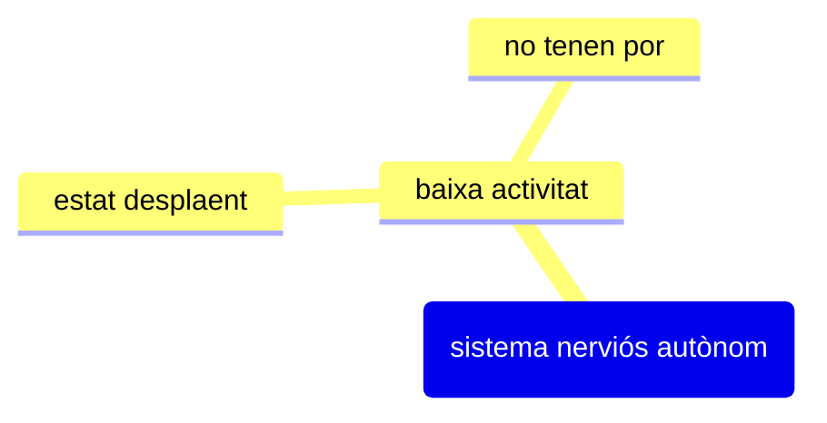

## Conceptes clau
El funcionament del sistema nerviós autònom por predisposar alguns individus al comportament delictiu.

## Detalls importants
Hi ha dues línies que sembla que podrien explicar aquesta predisposició.

D'una banda, la baixa activitat del sistema nerviós autònom podria fer que l'individu no sentís la por amb intensitat, cosa que facilitaria la violència i el comportament antisocial i la dificultat d'aprendre les normes socials, ja que no es té por al càstig.

D'altra banda, la baixa activació faria que l'individu estigués sempre en un estat desplaent i necessités d'emocions extremes per activar-lo. Aquestes emocions extremes podrien ser la violència i el comportament criminal.

## Exemples

## Preguntes
- 

## Resum

## Temes relacionats
- [[El renaixement de les variables biològiques]]
- [[Enfocament empíric incipient]]