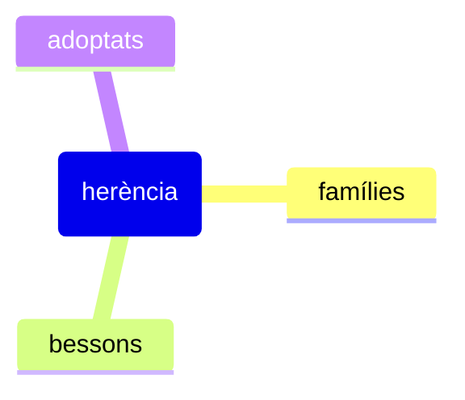

## Conceptes clau
S'han estudiat famílies, germans bessons i fills adoptius. Tots els estudis volen **delimitar la influència de l'herència sobre la de l'ambient**.

## Detalls importants
Pel que fa a les famílies, estudis al segle XX han trobat una relació forta de transmissió de trets psicopàtics i comportament criminal entre generacions.

En el cas dels germans bessons, es diferencia els monnozigòtics dels dizigòtics i s'assumeix una educació i ambient iguals. La coincidència de comportament criminal en els monozigòtics és superior a la dels dizigòtics. S'ha criticat que aquesta coincidència pot ser deguda al fet de ser tractats igual, cosa que matisaria l'efecte de l'herència genètica.

D'altra banda, en l'estudi de fills adoptats, es va trobar una correlació alta entre el comportament delictiu del fill adoptat i el pare biològic molt més important que el comportament delictiu del pare adoptiu.

## Exemples

## Preguntes
- 

## Resum

## Temes relacionats
- [[El renaixement de les variables biològiques]]
- [[Enfocament empíric incipient]]
