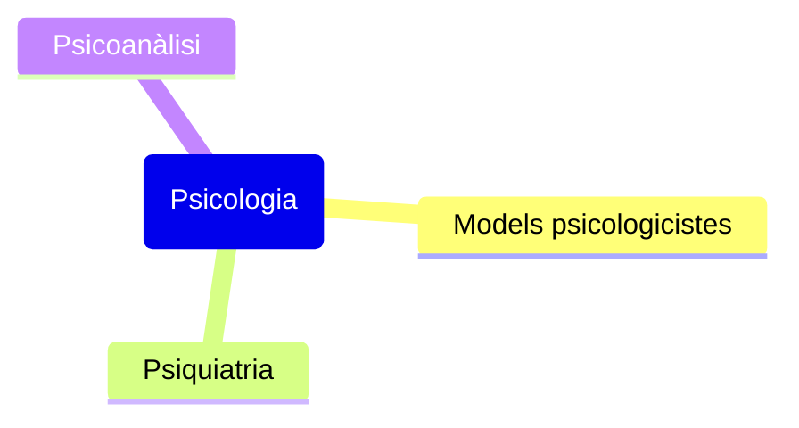

## Conceptes clau
Les teories psicològiques estan molt presents en la criminologia.

L'objectiu de [[Els Models Psicologicistes]] és explicar els comportaments des d'un punt de vista de processis psíquics o patològics. Algunes variables psicològiques que es correlacionen tradicionalment amb la conducta delictiva són:
- la intel·ligèngia
- la personalitat
- la hiperactivitat
- la impulsivitat
- el temperament
- la moralitat
- la psicopatia
- les habilitats socials

[[La Psiquiatria]] i [[La Psicoanàlisi]] també s'han de tenir en compte. La psiquiatria serà l'encarregada de delimitar el concepte de malaltia o trastorn mental, mentre que la psicoanàlisi estudia conflictes psíquics profunds que només es poden resoldre aprofundint en l'inconscient de l'individu.

## Detalls importants

## Exemples

## Preguntes
- 

## Resum

## Temes relacionats
- [[Els Models Psicologicistes]]
- [[La Psiquiatria]]
- [[La Psicoanàlisi]]
- [[Enfocaments psicològics en la criminologia contemporània]]