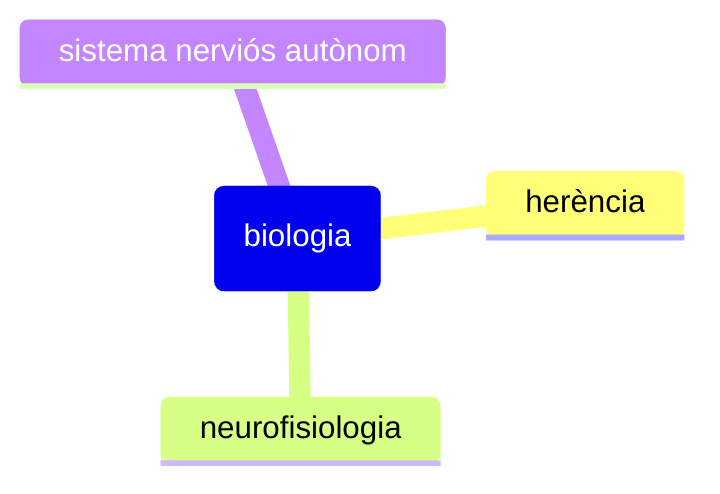

## Conceptes clau
Aquest renaixement es deu principalment a l'avançament que hi ha hagut en les ciències de la biologia i en el fet que les teories d'orientació social per explicar el fenome criminal no han estat completament satisfactòries.

## Detalls importants
Algunes de les perspectives biològiques són les següents:
1. **[[Influència de l'herència]]**. Intenta determinar la influència de l'herència i de l'ambient en la conducta delictiva. S'han estudiat famílies, bessons i fills adoptius.
2. **La neurofisiologia**. L'adveniment de l'electroencefalògraf (EEG) permet correlacionar irregularitats cerebrals amb conducta humana.
3. **[[El sistema nerviós autònom]]**. El funcionament del sistema nerviós autònom por predisposar alguns individus al comportament delictiu.
4. **Endocrinologia**. Els humans som un còctel d'hormones. Els seguidors d'aquesta corrent veuen l'ésser humà com un ésser químic, on un desequilibri entre els components pot explicar el comportament criminal. Són clàssics els estudis que relacionen els nivells de testosterona i el comportament delictiu en homes.

## Exemples

## Preguntes
- 

## Resum

## Temes relacionats
- [[Enfocament empíric incipient]]